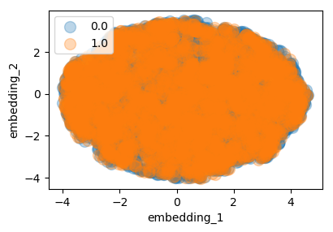

# Granular Learning in the Presence of Highly Contaminated Data

With the goal of learning quality levels via unsupervised anomaly detectors, we first are interested in finding if there is much overlap in the train and test datasets.  The log likelihood objective isn't always strong enough to encourage generative models to assign low probability to OoD data, so we check with a more reliable method -- optimization.  Using UMAP, we can see that these datasets fully overlap below.  Try this with other datasets such as MNIST vs Fashion MNIST or CIFAR10 vs SVHN and you'll easily tell them apart.

"0" = Train
"1" = Test
 <!-- width="400" hspace="20"> --> 
